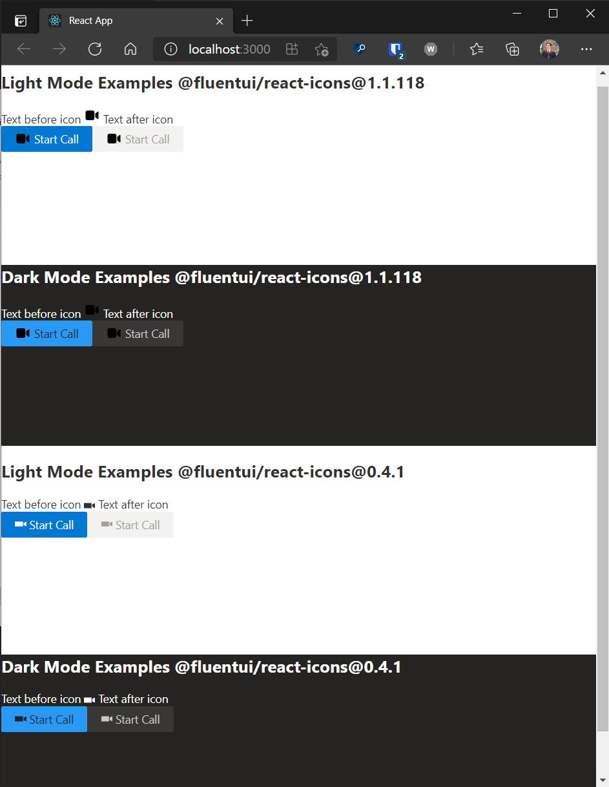

# Fluent Icon Bug Example Code

Simple app created with `create-react-app --typescript`.

Dependencies:

- "react": "16.8.0",
- "react-dom": "16.8.0"
- "@fluentui/react": "7.166.2"
- "@fluentui/react-icons": "1.1.118"
- "@fluentui/react-icons-old": "npm:@fluentui/react-icons@0.4.1"
- "@fluentui/react-theme-provider": "0.18.5"

## Run App

```bash
npm i
npm start
```

## App page


